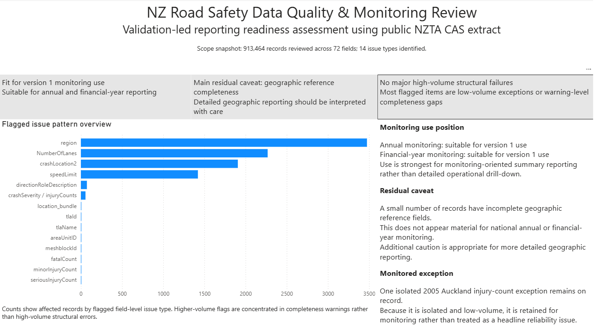

# NZ Road Safety Data Quality & Monitoring Review

A validation-led analytical portfolio project using publicly available NZTA Crash Analysis System (CAS) road safety data.

This repository reviews whether a public crash data extract is reliable enough for structured monitoring before stakeholder-facing interpretation is produced.



The workflow covers:
- field inventory
- quality validation
- targeted exception review
- monitoring-ready summary outputs
- stakeholder-facing interpretation with targeted caveats

---

## Project Objective

The objective of this project is to assess the reporting readiness of a publicly available NZ road safety dataset and document how an analyst might move from raw source data to a more disciplined reporting position.

The project is intended to demonstrate:
- structured review of source data before interpretation
- data quality validation using completeness, validity, consistency, and uniqueness checks
- exception review with materiality-based interpretation
- monitoring-ready summary outputs for annual and financial-year use
- stakeholder-safe documentation of limitations and caveats

---

## Current Status

**Current phase:** Phase 3 complete — quality validation complete, monitoring layer implemented, and stakeholder-facing presentation outputs packaged

The project has moved beyond setup and initial validation.  
The repository now reflects a documentation-heavy, reporting-oriented analytical workflow with front-facing presentation outputs added for portfolio use.

Completed analytical and presentation layers:

1. **Field Inventory Layer**
   - `scripts/01_field_inventory.R`
   - reviews raw extract structure, missingness, and date coverage

2. **Quality Validation Layer**
   - `scripts/02_quality_checks.R`
   - applies completeness, validity, consistency, and uniqueness checks

3. **Severity Exception Review**
   - `scripts/02a_review_severity_conflicts.R`
   - refines interpretation of severity-related conflicts

4. **Exception Review and Monitoring Layer**
   - `scripts/03_exception_review_and_monitoring_layer.R`
   - converts validation outputs into monitoring-ready and stakeholder-facing summary tables

5. **Portfolio and Presentation Outputs**
   - one-page portfolio snapshot
   - workflow diagram
   - Power BI summary view
   - static figure set
   - stakeholder-friendly Excel supporting export
   - concise monitoring interpretation note

---

## Current Version 1 Reporting Position

The current documented position is:

- no major high-volume structural failures were identified
- most flagged items are low-volume exceptions or warning-level completeness gaps
- the main residual caveat is a very small number of incomplete geographic reference records
- one isolated historical injury-count exception remains on record as a monitored exception
- overall position: **fit for version 1 monitoring use, with targeted caveats rather than broad reliability concerns**

In practical terms, this means the current extract appears suitable for:
- annual monitoring
- financial-year monitoring
- severity and outcome review
- stakeholder-facing interpretation with clear caveats

For a concise one-page statement of the final version 1 conclusion, see:
- `docs/final_reporting_position.md`

For a stakeholder-facing monitoring interpretation note, see:
- `docs/monitoring_summary.md`

---

## Main Caveat

The main residual caveat is a small number of records with incomplete geographic reference fields such as:
- `tlaId`
- `tlaName`
- `areaUnitID`
- `meshblockId`

This is not expected to materially affect:
- national annual summaries
- national financial-year summaries
- broad monitoring interpretation

However, additional caution is appropriate where reporting becomes more geographically detailed, including:
- TLA-level reporting
- area-unit or meshblock-linked analysis
- map-based outputs
- tightly scoped local-area summaries

A separate isolated historical exception also remains on record:
- one 2005 Auckland record with missing `fatalCount`, `seriousInjuryCount`, and `minorInjuryCount`

Because it is isolated and low-volume, it is retained as a monitored exception rather than treated as a broader stakeholder concern.

---

## Current Extract Profile

Primary working file:
- `data/raw/Crash_Analysis_System_(CAS)_data.csv`

Reviewed extract profile:
- Rows: 913,464
- Columns: 72

---

## Portfolio Snapshot and Visual Outputs

To make the completed review easier to assess at a glance, the repository includes a small set of front-facing presentation outputs alongside the core technical documentation.

### Main visual assets
- `assets/portfolio_snapshot_onepager.png` — one-page visual summary of the project position, key findings, and reporting caveat
- `assets/project_workflow_diagram.png` — simplified workflow view showing how the project moves from field review through validation, exception review, monitoring, and final interpretation
- `assets/pbi_main_summary_screenshot.png` — Power BI summary view used as the main dashboard-style presentation artifact

### Static figures
- `outputs/figures/fig_01_v1_validation_to_monitoring_workflow.png`
- `outputs/figures/fig_02_validation_outcome_summary.png`
- `outputs/figures/fig_03_quality_monitoring_annual_fy_issue_coverage.png`
- `outputs/figures/fig_04_geographic_completeness_caveat_matrix.png`

### Supporting export
- `outputs/excel/nz-road-safety-monitoring-supporting-export.xlsx` — stakeholder-friendly workbook summarising reporting position, validation outcomes, exceptions, and monitoring-facing caveats

### Supporting interpretation note
- `docs/monitoring_summary.md` — concise stakeholder-facing interpretation of what the validation and monitoring outputs mean for Version 1 use

These outputs do not introduce a new analytical framework.  
They package the completed validation-led review into recruiter-facing and stakeholder-facing outputs that make the project easier to assess at a glance.

---

## Repository Structure

```text
nz-road-safety-data-quality-monitoring/
│
├── assets/
│   ├── portfolio_snapshot_onepager.png
│   ├── project_workflow_diagram.png
│   └── pbi_main_summary_screenshot.png
│
├── data/
│   ├── raw/
│   ├── processed/
│   └── reference/
│
├── scripts/
│   ├── 01_field_inventory.R
│   ├── 02_quality_checks.R
│   ├── 02a_review_severity_conflicts.R
│   └── 03_exception_review_and_monitoring_layer.R
│
├── outputs/
│   ├── tables/
│   ├── figures/
│   │   ├── fig_01_v1_validation_to_monitoring_workflow.png
│   │   ├── fig_02_validation_outcome_summary.png
│   │   ├── fig_03_quality_monitoring_annual_fy_issue_coverage.png
│   │   └── fig_04_geographic_completeness_caveat_matrix.png
│   └── excel/
│       └── nz-road-safety-monitoring-supporting-export.xlsx
│
└── docs/
    ├── project_status.md
    ├── decision_log.md
    ├── executive_summary.md
    ├── final_reporting_position.md
    ├── stakeholder_brief.md
    ├── monitoring_summary.md
    ├── project_charter.md
    ├── methodology.md
    ├── data_dictionary.md
    ├── assumptions_and_limitations.md
    └── data_sources.md

Key Outputs

The repository includes both technical monitoring outputs and presentation-facing portfolio outputs.

Technical outputs

field inventory and reviewed field coverage
issue summaries and exception registers
annual and financial-year monitoring summaries
priority-field completeness tracking
stakeholder headline summary tables

Presentation outputs

one-page portfolio snapshot
workflow diagram
Power BI summary view
static figure set
stakeholder-friendly Excel export
monitoring summary note

For field-level structure and missingness, outputs/tables/field_inventory.csv is the source-of-truth inventory output for the reviewed Version 1 extract.

Where some generated outputs are not visible in Git, the scripts and supporting documentation should be treated as the source of truth.

Analytical Framing

Version 1 is primarily framed around:

annual monitoring
financial-year monitoring
severity and outcome review
geographic data quality review
issue logging and monitoring-oriented summaries

It is not primarily framed as a monthly or daily operational reporting workflow.

This reflects the structure of the reviewed extract, which is more naturally aligned to:

crashYear
crashFinancialYear

than to a strongly event-date-driven operational reporting design.

Interpretation Approach

A core project principle is:

validate before interpreting

This means stakeholder-facing interpretation is intentionally based on:

field inventory
formal validation logic
targeted severity exception review
monitoring-oriented summary outputs
documented caveats and limitations

The project also applies a materiality-based interpretation rather than treating every flagged row as an equally important stakeholder issue.

In practice, this means:

low-volume exceptions are interpreted proportionately
national monitoring use is distinguished from detailed geographic reporting risk
isolated anomalies are not automatically elevated into headline reporting concerns
Supporting Documentation

Further project interpretation and documentation are available in:

docs/project_status.md
docs/decision_log.md
docs/executive_summary.md
docs/final_reporting_position.md
docs/stakeholder_brief.md
docs/monitoring_summary.md
docs/project_charter.md
docs/methodology.md
docs/data_dictionary.md
docs/assumptions_and_limitations.md
docs/data_sources.md
Important Positioning Note

This repository is an independent portfolio project using publicly available data.

It does not represent:

official NZTA analysis
official government reporting
operational sign-off on source-system quality
a production enterprise reporting framework