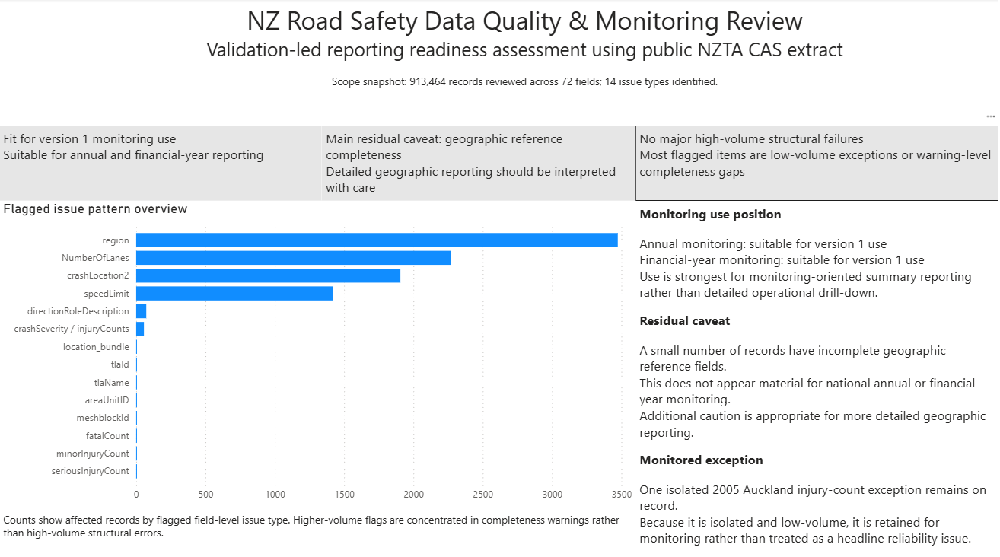

# NZ Road Safety Data Quality Review for Reporting and Monitoring

A portfolio project showing how an analyst can validate a large public dataset before using it for recurring reporting, then turn the findings into reproducible SQL, R, Power BI, Excel and stakeholder-facing outputs.



## Project in one sentence

I reviewed 913,464 New Zealand road-safety records, built rule-based R and SQL validation workflows, reconciled their results and produced monitoring-ready outputs with explicit reporting caveats.

## Business problem

Before a team uses a dataset for recurring monitoring or stakeholder reporting, it needs evidence that the source is complete, consistent and safe to interpret.

This project therefore starts with **validate before interpreting**:

1. inspect the source structure and expected grain
2. apply formal completeness, uniqueness, validity and consistency checks
3. trace failed checks to source records
4. separate blocking defects from monitored exceptions
5. expose stable reporting views and reconcile independent implementations
6. communicate what the data can and cannot safely support

## Key result

The reviewed extract is **fit for Version 1 monitoring use, with targeted caveats rather than broad structural reliability concerns**.

The SQL extension adds independently verifiable evidence:

- 913,464 source rows and 913,464 distinct crash IDs
- 12 rule-based quality checks
- 8 reporting-consumption views
- 6 representative analytical questions
- 12 release tests, all passing
- exact agreement with R for annual totals, financial-year totals, selected missingness and severity/casualty totals

## Main caveats

The main residual risk is detailed geography:

- 5 records have an incomplete TLA reference
- 4 records have an incomplete area-unit or meshblock reference
- 3,474 records have no region value, approximately 0.3803% of the extract

These exceptions do not materially affect national annual or financial-year totals, but they require more care for TLA-level, local-area and map-based reporting.

One isolated 2005 Auckland record is also missing `fatalCount`, `seriousInjuryCount` and `minorInjuryCount`. It is retained as a documented review exception rather than silently corrected.

## Tools used

- **SQL / DuckDB** for staging, profiling, rule-based checks, exception traceability, reporting views and reconciliation
- **R / data.table** for the original field inventory, quality review and monitoring outputs
- **Power BI** for the summary reporting view
- **Excel** for a stakeholder-friendly supporting export
- **GitHub** for reproducible project structure and evidence

## Quick review paths

### 30 seconds

- this README
- `assets/pbi_main_summary_screenshot.png`
- [final reporting position](docs/final_reporting_position.md)

### 3 minutes

- [SQL workflow guide](sql/README.md)
- [quality rules](sql/02_quality_checks.sql)
- [monitoring views](sql/04_monitoring_views.sql)
- [R-SQL reconciliation](docs/sql_reconciliation.md)

### 15 minutes

- prepare the source using [data/README.md](data/README.md)
- run `duckdb road_safety.duckdb -c ".read sql/run_all.sql"`
- inspect `outputs/sql/validation_results.csv`
- review [methodology](docs/methodology.md), [data model](docs/sql_data_model.md) and [limitations](docs/assumptions_and_limitations.md)

## Data reviewed

- Source: public NZ Transport Agency Waka Kotahi Crash Analysis System extract
- Local snapshot: `data/raw/Crash_Analysis_System_(CAS)_data.csv`
- Rows: 913,464
- Columns: 72
- Crash years: 2000-2026 in the reviewed snapshot
- Raw-data handling and checksum: [data/README.md](data/README.md)

The large raw CSV is excluded from Git. Small R baseline controls are kept in `data/reference/` so the SQL workflow can prove exact reconciliation.

## SQL workflow

```text
CAS CSV
  -> typed staging table
  -> source controls and profiling
  -> 12 quality rules
  -> record-level exception register
  -> annual, FY, severity, geography and quality views
  -> 6 business-question views
  -> R-SQL reconciliation and release gate
  -> Power BI-ready CSV outputs
```

Run from the repository root with DuckDB 1.5.x:

```powershell
duckdb road_safety.duckdb -c ".read sql/run_all.sql"
```

On Windows, `scripts/run_sql.ps1` provides the same workflow. On macOS and Linux, use `scripts/run_sql.sh`.

## Quality-rule status

| Status | Rules | Interpretation |
|---|---:|---|
| PASS | 7 | No failed records |
| REVIEW | 4 | Low-volume exceptions retained with explicit treatment |
| MONITOR | 1 | Region missingness tracked over time |
| FAIL | 0 | No release-blocking quality rule failed |

The detailed rule catalogue and current counts are in [sql/README.md](sql/README.md) and `outputs/sql/quality_check_results.csv`.

## Outputs

### SQL evidence

- `outputs/sql/quality_check_results.csv`
- `outputs/sql/exception_summary.csv`
- `outputs/sql/exception_register.csv`
- `outputs/sql/power_bi_quality_check_summary.csv`
- `outputs/sql/power_bi_annual_crash_monitoring.csv`
- `outputs/sql/power_bi_geographic_completeness.csv`
- `outputs/sql/validation_results.csv`

### Existing presentation evidence

- `assets/portfolio_snapshot_onepager.png`
- `assets/project_workflow_diagram.png`
- `assets/pbi_main_summary_screenshot.png`
- `outputs/excel/nz-road-safety-monitoring-supporting-export.xlsx`

The original R-generated Excel and figure outputs are described in the supporting documentation. Large or regenerated outputs remain excluded from Git unless they are compact review evidence.

## Repository structure

```text
nz-road-safety-data-quality-monitoring/
|-- assets/                 # Portfolio and Power BI images
|-- data/
|   |-- raw/                # Ignored public CAS CSV
|   |-- processed/          # Ignored generated data
|   `-- reference/          # Versioned R baseline controls
|-- docs/                   # Methodology, scope, reconciliation and caveats
|-- outputs/
|   `-- sql/                # Compact, versioned SQL evidence
|-- scripts/                # Existing R workflow and SQL launchers
|-- sql/                    # DuckDB setup, checks, views, analysis and tests
`-- README.md
```

## Documentation

- [SQL extension scope](docs/sql_scope.md)
- [SQL data model](docs/sql_data_model.md)
- [R-SQL reconciliation](docs/sql_reconciliation.md)
- [Power BI SQL connection](docs/power_bi_sql_connection.md)
- [Methodology](docs/methodology.md)
- [Data dictionary](docs/data_dictionary.md)
- [Data sources](docs/data_sources.md)
- [Assumptions and limitations](docs/assumptions_and_limitations.md)
- [Stakeholder brief](docs/stakeholder_brief.md)

## Reporting boundary

This is an independent portfolio project using publicly available data. It is not official NZTA analysis, official government reporting, operational sign-off on source-system quality or a production enterprise reporting framework.

The findings apply to the reviewed snapshot. A refreshed CAS extract must be rerun through the same controls before the conclusions are reused.
